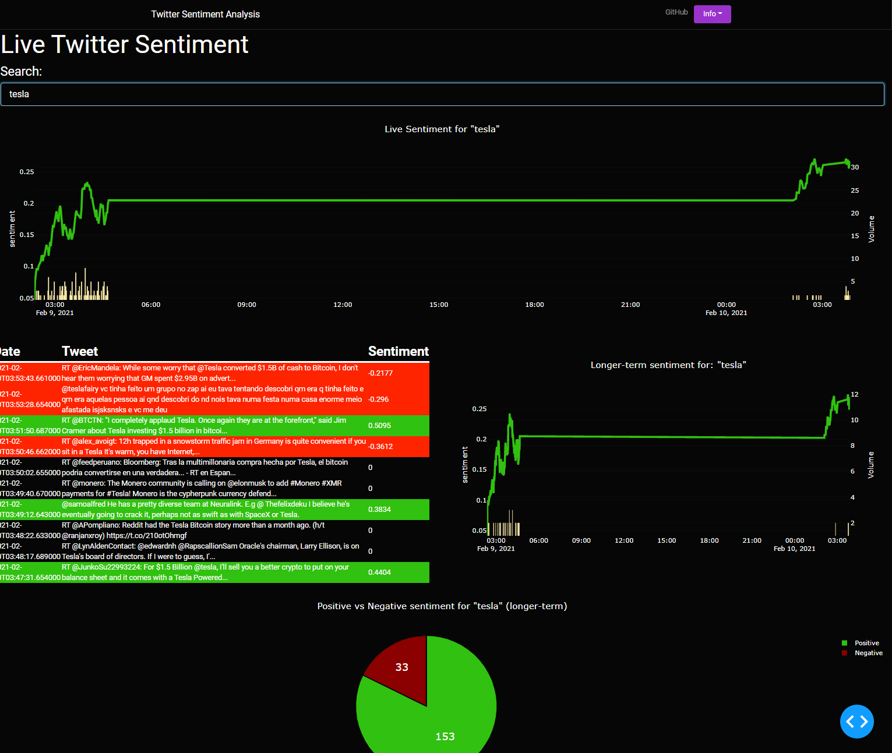
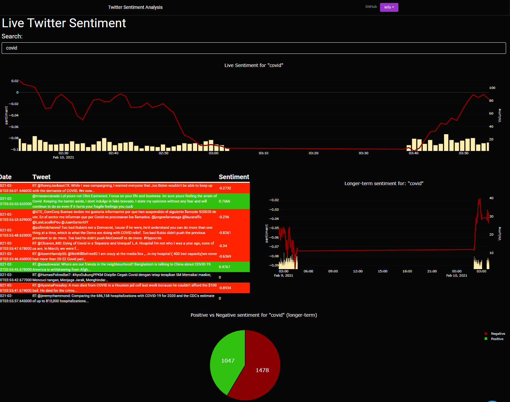

# Python Sentiment Analysis on Twitter Data

## Dash

Dash is a productive Python framework for building web analytic applications.

Written on top of Flask, Plotly.js, and React.js, Dash is ideal for building data visualization apps with highly custom
user interfaces in pure Python. It's particularly suited for anyone who works with data in Python.

[Dash Website](https://dash.plotly.com/introduction)

## Purpose
This project starts off by
* Connecting with the Twitter api and pulling in Tweets
* Performing
sentiment analysis on the Tweets
* Connecting to the database and storing the Tweets and related analysis 
* Using the front-end GUI, allow for searchable terms to be looked up in database to view in graphical detail the sentiment

## TO-RUN
start by running the twitter_stream2.py application after settings your corresponding 
env variables for twitter. After, the application will stream tweets and store into a sqlite3 db,
then run the display.py application to run the display of the app in Dash.

## Tesla Sentiment Example

## Covid Sentiment Example

### NOTES
- Fixed UI w/ DashBootstramp components
- Added coloring depending on sentiment
- Removed DB to start fresh (GitHub will not store that large file)

## Migrating to SQL for hosting
